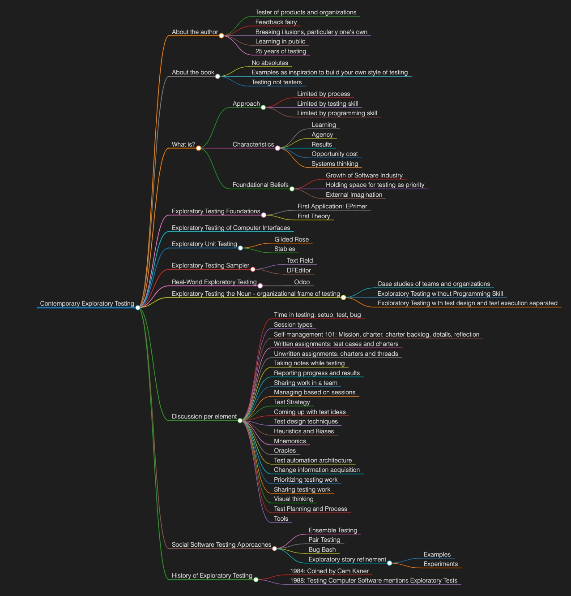

# Introduction

It's a new year, and this new year is my 25-year career anniversary. I have had earlier versions of the book available, and recent turns of events have lead me to better understand what the book is about.

> Not just **Exploratory Testing** but **Contemporary Exploratory Testing**

It's not about writing bigger test cases and calling them charters so that we can distribute work in an agile team. 

It's not about the thinking work you do with your hands in the game, but all tools are allowed. I take it a notch further, automation is encouraged and compulsory part of exploratory testing on a team level. 

> Not a new namespace with ultimate coherence of concepts but a collection of examples and experiences explained. 

This book grows chapter by chapter and it has a deadline: my 25th career anniversary in start of October. Access to an early version will give you access to the final version. 

