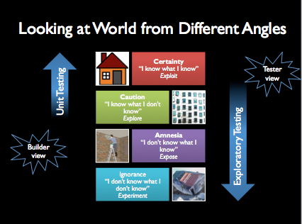
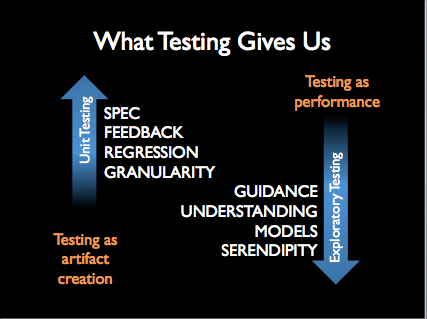

# Two ideas of Testing

Imagine two experts of testing in a room, delivering a testing training together. The training is named "Collaborative Exploratory and Unit Testing". Both experts know their trade. As the training unfolds, the undercurrent of disagreement emerges. Disagreement leads to productive discussions, and increased understanding. The disagreement isn't about importance of testing, or that both kinds of testing would be relevant. The disagreement is about *what testing is*.

There is two ideas of testing, and both are important. But they need different words to describe them. Both ideas seek effective and efficient ways of including testing into software development.

The idea of *unit testing* comes from a mindset of *testing as artifact creation*. It's a *builder view*, where you build tests for your information needs.

The idea of *exploratory testing* comes from a mindset of *testing as performance*. It's a *tester view*, where you learn through doing testing and as a result, might build some tests for information needs of continuous nature.

## Builder and Tester Views

A *builder view* starts at the beginning of software creation, and works through the steps of creation *for* quality in delivery. Builders combine theories into designs aiming at solving the right problems, and theory builds a foundation for success with versatile cases of requirements.

A *tester view* starts at the end of software creation, with the idea of value for stakeholders, and works through the steps of creation *from* quality in delivery. Testers focus on empirical evidence over theory, and any early activities towards quality are important rehearsals for the empirical information delivered towards the delivery.

We're all builders and testers, but we may specialize in getting deeper in one than the other. We're never *just* anything. Every developer tests. But most developers test from a builder view. Tester view extends the scope of testing from builder view into a tester view.

The builder view is optimistic. There's things we know we know, and there's things we know we don't know, but need to find out. There's a lot of work building things we know of, and as builders, we focus on building them one by one.

The tester view is opportunistic. There's things we don't know we know, and there's things we don't know we don't know. The unknown unknowns are particularly interesting. They are an opportunity of learning and delivering information that changes our perceptions of the world of software we are creating.

## What We Know and What We Don't Know

### A House-Building Example

Imagine you are about to build a house. You know what a house looks like. Your house should have foundation, doors and windows, a roof and all the requirements you know to set on a house. These are things you have certainty on, and it might take a while to gather together all the knowledge of your requirements for the house. What you know that you know, you can exploit. It's information readily available to you. There might a be lot of it, and it requires backtracking to make sure you don't forget one of these things.

You carefully think about the requirements for your house, and realize you really don't yet know how many windows your house should have. And you realize that not knowing that isn't going to be ok for you to get the house you want. So you mark the thing you know you don't know on your task list to make a decision on. It's there to caution you on spending some time on learning about it, to explore your opportunities on windows.

There's also things you know, but have forgotten. Perhaps in building the house, one of the tiles in a wall was special, but not special enough to pay attention to. Sometimes you need to look at what you have built, and relearn things you have known, and need to expose again. With a lot of details, it is easy to abstract out some that are relevant.

Finally, there's things that unfold as surprises. You don't know that you don't know them, so having them on your list of things to find out will not work. You will perhaps notice them with active learning about your environment. You need to experiment. Perhaps you learn, that there's a very small chance of landfalls just where you built your house and that your house type is particularly vulnerable for this kind of problem. You might rather learn this before it takes down your house and yourself with it. You want to give unexpected information chances to emerge and turn from unknown unknowns into the real of things we know of.

### Relevance to Two Views of Testing

When we look at building and testing software from a builder view, we have a tendency of focusing on known knowns and known unknowns. The learning while building is focused on things we have identified we need to learn on.

Software unfolds in unexpected ways. Perhaps the browser assumptions we're building our software on aren't correct, and while our code is right for the things we thought are true, it just does not work. Works as designed, not really as intended. Perhaps the low battery mode we all know of and have never had problems on disagrees with the latest feature we've added on our mobile application. We're building our code to base on software built by others, and we can't keep track of all the aspects there are now, let alone all the aspects that changes to the environment we depend on will cause us. Perhaps the marketing feature that with click of a button sends emails to all people in the users addressbook is causing direct costs outside your immediate application for the unsuspecting user clicking that button. That mass of annoyed users brings your business' reputation down, giving you a permanent stain that gets mentioned every time people talk about using your systems.

The unit testing view focuses on things of certainty and caution. Exploratory testing view focuses on things of ignorance, amnesia and caution. Starting from a wider scope tends to result in different type of information. There's a process of knowing and it is called learning. Exploratory testing is all about learning.

### Artifacts and Performances

To create an artifact (a collection of tests), you need to have things you know of. Each of these can turn into something you test for.

To find about unknowns and turn them into the realm of knowns, you design experiments to learn. Learning is a performance, where the information reveals itself to you over time. It combines active empirical use of the software and practice rounds with unfinished software or even prototypes of the software to models of perspectives that could be relevant.

This is why we talk about the unit (builder) view to testing as *testing as artifact creation*. With this idea of testing, we're turning what we know into tests that help us keep track of what we know. The exploratory (tester) view to testing we refer to as *testing as performance*.

Imagine watching a theater performance. The actors are skilled professionals, trained in their craft and its techniques. They rehearse to know the basic structure, and as the rehearsals go on, they add deeper elements to the performance. Finally comes the time of the premiere, where all pieces including the audience fall together. The learning doesn't stop there, but the excitement might be at it's peak with a deadline. Every round of rehearsals have value, and they allow to focus on some specific piece of information that testing should provide. At first you see the surface and the testing you can do is shallow but still valuable. Continuing forward in learning reveals new layers of information, as the application unfolds in unexpected ways when we're actively learning about its quality and factors related to customer and user experience, and success of our business.

## What Testing Gives Us

The two experts views put together results in describing with very different words what testing as we know it gives us.  

### Testing as Artifact creation

Testing is a viewpoint that transforms into tests. There are four things testing gives us from artifact creation viewpoint.

   * Spec
   * Feedback
   * Regression
   * Granularity

Having tests gives you **spec**, that helps you understand what you are building. With the test, you can see the form of the function call, and improve it's design in relation to your intent of what you're building. This is a typical value of test-driven development approach.

When you implement and you have the tests, you get **feedback**. The tests tell you that if you are making progress on getting the implementation in place. The tests describe scenarios and behaviors that fail without adding the related functionality, and that pass when the functionality is in place as intended. 

### Testing as Performance

Does not give as regression; serendipity (safety against things happening randomly) / unwanted serendipity events.

This is what it is and what it could  be. There’s a direction to it, not just statement of what it is.
Coaching is not just feedback, it’s pointing them to the right way.

Safety.

EXPERIENCE (the verb) rather than facts ; emotions over facts. REACTIONS.

HISTORY, Lessons learned, checklists. Modeling.

UNDERSTANDING – where you start (knowing the thing (code & environment), knowing the user, knowing the problems, knowing the developers (how to help them and what they do so that you can efficiently test), knowing the hackers (weird use cases outside common ‘have you tried reading it upside down’) , knowing all stakeholders, knowing the business priorities)

Uncovering things I cannot know, giving the application a change to reveal information for me.

This allows you to know things.

If you are not learning anything, you're doing it wrong.

Automation from artifact and performance perspectives.
