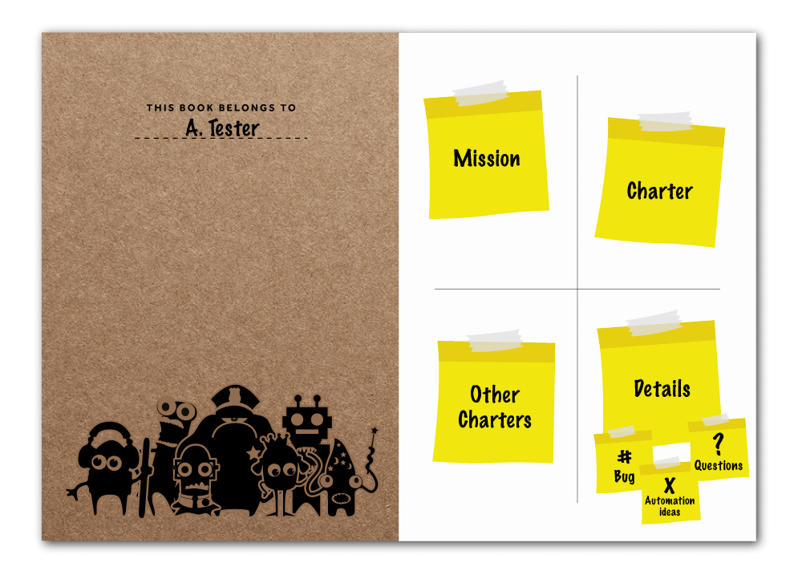

# How to Explore with Intent - Exploratory Testing Self-Management

*This article was published in Ministry of Testing Testing Planet in 2016. Appropriate pieces of it will find their place as part of this book.*

Exploratory testing is the wonderful idea that we can use our freedom of choice while testing, to learn as we go on and let that learning influence the choices we make next. The system we test is our external imagination, and it's our responsibility to give it the chance to whisper out all the information there is.

When we test, everyone is allowed to stretch their assigned boxes with exploration at least a little. Even the most test case oriented organizations will ask you to think, learn, and look around while executing your assigned tests. That's what makes you good at testing in the organization.

For more of a stretch, these organizations will allow for a few hours of freedom from the assigned box, to do some time-boxed exploratory testing for finding gaps your usual test case harness keeps you from spotting.

Others, like myself, work in the exploratory testing mode full time. In this mode, test cases (if such will exist) are an output of the process instead of an input and created at a time we know the most about a feature or product. We've learned a lot by the time we're done testing.

Regardless of whether your mode of exploratory testing is using it as technique (extending your test cases), as a task (time-boxing exploration) or as an approach (engulfing all your thinking of testing), there's a critical skill of self-management you'll need to develop. You'll want to explore with intent, keep track of what you know and learn, and what more there is to learn. All of this will grow iteratively and incrementally as you do this type of testing.

## Intertwining Different Testing Activities

With years of practice on skilled exploration, I find it now possible to do different activities simultaneously. I can strategize on a testing big picture and create tasks out of the ideas. I can execute testing on some of those ideas configuring the environments and learn from the different types of thinking. It's not really simultaneous, it's intertwined into these tiny bits of tasks, allowing my mind to wonder and categorize things into a frame of reference.

It was not always possible. Actually, it was really hard. In particular, it is really hard to intertwine long-term (looking into future work) and short-term (looking at what is going on now) thinking, which are very different in nature. It's ok, because the ability to intertwine is not a requirement to get started. You would do well acknowledging where your abilities are and developing them further by practicing intertwining, but also allowing yourself time to focus on just one thing. With exploratory testing, the formula includes you: what works for you, as you are today.

### A Practical Example

Imagine learning to drive a car. You're taking your first lessons at the driving school and after some bits of theory you know the basic mechanics of driving but have never done any of it.

You've been shown the three pedals, and when you stop to think, you know which one is which. You know the gear shifter and it's clear without telling what the steering wheel does (as long as you drive forward, that is). And finally comes the moment you're actually going to drive.

The driving instructor makes you drive a couple of laps around the parking lot and then tells you to drive out, amongst other cars. With newness of all of this, your mind blanks and you remember nothing of the following half an hour. And if you remember something, it's the time when your car stopped at an embarrassing location because it was too hard to do the right combination of clutch and gears.

All the pieces are new and doing the right combination of even two of them at the same time is an effort. Think about it, when you looked if you could turn right, didn't you already start turning the wheel? And when you were stopped at the lights to turn, didn't it take significant effort to get moving and turn at the same time?

After years of driving, you're able to do the details without thinking much, and you're free to use your energy on optimizing your route of the day or the discussion you're having with the person next to you. Or choosing a new scenic route without messing up your driving flow.

It's the same with testing. There's a number of things to pay attention to. The details of the application you're operating. The details of the tools you need to use. The uncertainties of information. All your thoughts and knowledge. The information you get from others, and whether you trust it or not. The ideas of what to test and how to test it. The ideas of what would help you test again later. The expectations driving you to care about particular type of information. Combining any two of these at a time seems like a stretch and yet with exploratory testing, you're expected to keep track of all of these in some way. And most essentially from all the details, you're expected to build out and communicate both a long-term and a short-term view of the testing you've done and are about to do.

## Learning To Self-manage

I find that a critical skill for an exploratory tester is the skill to self-manage, and to create a structure that helps you keep track of what you're doing. Nowadays, with some years of experience behind me, I just create mind maps. There is a simple tool I found to be brilliant for learning the right kind of thinking, and that tool is what I want to share with you.

When I say tool, I mean more of a thinking tool. The thinking tool here though has a physical structure.

For a relevant timeframe, I was going around testing with a notebook for a very particular purpose. Each page in the notebook represented a day of testing, and provided me a mechanism to keep track of my days. A page was split into four sections, with invisible titles I've illustrated in the picture: Mission (why am I here?), Charter (what I'm doing today?), Details (what am I keeping track of in details?) and Other Charters (what should I be doing before I'm done?).

At the start of a day of testing, I would open a fresh page and review my status after letting earlier learning sink in. Each of the pages would stay there to remind me of how my learning journey developed as the application was built up, one day at a time.

### Mission

In the top left corner, I would stick a note about my mission, my purpose or as I often liked to think of it, the sandbox I was hired to play in. What did the organization expect of me as per information I would provide, having hired me as an exploratory tester? How I could describe that in just a few sentences?

For example, I was hired in an organization with ten teams, each working on a particular area of the product. My team was specializing in installations. That little note reminded me that while I could test anything outside the installations if I so wished, there was a sandbox that I was supposed to cover for relevant findings and it was unlikely that others would feel the urge to dig deep into my area.

They were likely to travel through it, but all the special things in the area, they would probably rather avoid. If I would be digging through someone else's area, nothing would stop me. But I might leave mine unattended. I might feel that I used all this time, and therefore I'm done, even if I was only shallowly covering my own area.

The mission note reminded me of the types of information the organization considered relevant, and the area of responsibility I felt I had accepted. It served as an anchor when the whispers of the product lead me elsewhere to explore.

### Charter

In the top right corner was my note about the work of the day: the Charter. Each morning I would imagine what I was trying to achieve today - only to learn most evenings I had done something completely different. Charter is a framing of what I'm testing, and as I learn they change over time. It's acceptable to start out with one idea and end up with something completely different when you are finished.

The note of the day was another anchor keeping me honest. With exploration, I'm not required to stick to my own plans. But I'm required to be in control of my plans in the sense that I don't fool myself into believing something is done just because the time is used.

Continuing on my example with the Installations team, I might set up my charter of the day to be 2 installations with a deep dive into what actually gets installed. Or I might set it up to be 20 installations, looking through each shallowly. Or I might decide to focus on a few particular features and their combinations. If I saw something while testing that triggered another thought, I could follow it. But at the end of the day, I could review my idea from the morning: did I do 20 shallow installations like I thought I would? If I didn't, what did I do? What am I learning for myself from how things turned out?

### Details

In the bottom right corner, I would pile up notes. At first, these were just lines of text I would write that would often fill the page next to the one I was working on. Later, I realized, that for me there were three things I wanted to make notes of: the bugs, the questions, the ideas for test automation or test cases, and my notes extended to have a categorization shorthand.

With any of the detailed ideas, I could choose to stop doing the testing I was doing, and attend to the detail right away. I could decide that instead of focusing on exploring to find new information, I could create an automated test case from a scenario I cooked up from exploration. I could decide that instead of completing what I was planning on doing today, I would write the great bug report with proper investigation behind it. I could decide to find a product owner, a support representative, a programmer, or my manager to get an answer for a burning question I had. Or, I could make note of any of these with minimum effort, and stick to my idea of what I would do to test the application before attending to the details.

I learned that people like me can generate so many questions, that if I don't have a personal throttling mechanism, I can block others from focusing on other things. So I realized that collecting the questions and asking them in regular intervals was a good discipline for me. And while looking through my questions, I would notice that I had answers to more questions myself than I first thought.

With each detail, the choice is mine. Shall I act on this detail immediately, or could it wait? Am I losing something relevant if I don't get my answer right away? Is the bug I found something the developer would rather know now, than at the end of my working day? Do I want to stop being in exploratory mode to improve my documentation, or to  pair with a developer to implement a piece of test automation, or do I rather time-box that work for another day from the idea I had while testing?

### Other Charters

In the bottom left corner, I would make notes of exploratory testing work I realized needed doing while I was testing. I would write down ideas small and large that I would park for future reference, sometimes realizing later that some of those I had already covered and just forgotten. Sometimes I would add them to my backlog of work to do, and sometimes tuning the existing backlog of work to support choosing focus points of upcoming testing days.

Some of my ideas would require creating code for purposes of extending the reach of exploration. Some ideas would require getting intimately familiar with the details of log files and database structures. Each new idea would build on the learning that had happened before, making me reassess my strategy of what information I would invest in to have available first.

## You're In Control

The tool isn't there to control you, it's there to give you a structure to make your work visible for you. You get to decide what happens when you explore, and in what order. If you need to go through a particular flow 15 times from various angles, you do that. If you find it hard to think about strategy and importance of particular tasks when you're deep in doing testing, you reserve time separately for strategic thinking.

With the days passing, and notes taken, I could go back seeing what types of sessions I would typically have. There would be days where I'd just survey a functionality, to figure out a plan of charters without focus on details. There would be target rich functionalities, where the only detail I could pay attention to was the bugs. Over time, I could pay attention to doing things intentionally with particular focus, and intentionally intertwined. I could stop to think, how different days and different combinations made me feel. I learned to combine things in ways that were useful for my organization, but also maximized the fun I could have while testing in a versatile manner.

While most value was in learning to self-manage my testing work around learning, there was also a side impact. When someone would show up to ask about what I had done and was doing, I could just flip a page and give an account of what had been going on. Seeing the structure created trust in those who were interested in my progress.

As an active learner, you will get better every day you spend on testing. Exploratory testing treats test design, test execution and learning as parallel, as mutually supportive activities to find unknown unknowns. Doing things in parallel can be difficult, and testing needs to adjust to the tester's personal skill level and style. Your skill to self-manage your work and your learning - making learning and reflection a habit - is what differentiates skilled exploratory testing from randomly putting testing activities together.

I believe that the thing that makes us, testers, to not be treated as a commodity, is learning. It's the same with programmers. Learners outperform the ones that don't. Exploratory testing has learning at it's core.
