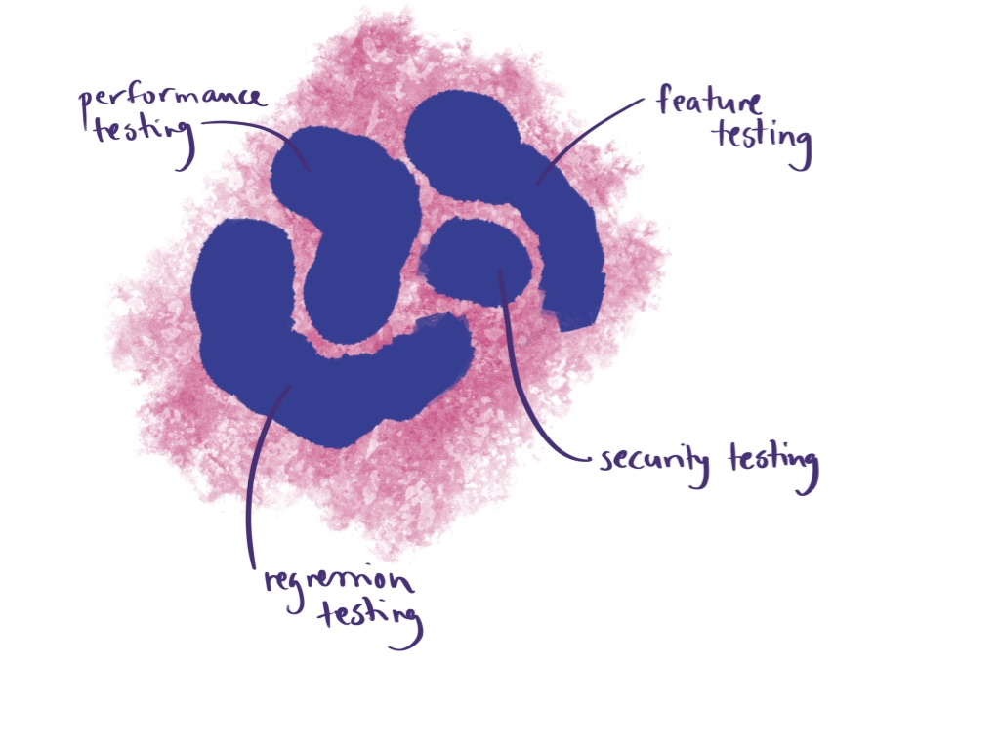

# Where is Exploratory Testing

When people start learning about testing, and agile testing in particular, they quickly get to a model of testing quadrants. Testing quadrants, popularized by Janet Gregory and Lisa Crispin with their Agile Testing book, place a collection of testing words in four quadrants. When you go look, you can find "exploratory testing" in the top right corner, meaning it is considered Business Facing Product Critique.

As the term was coined 35 years ago to express a specific approach to testing, making it a technique in one corner of the quadrants was not the intent. It expressed a style of testing unfamiliar to the majority, that was observable in Silicon Valley product companies, a skilled multidisciplinary testing under product development constraints.

The world moved on, and testing certifications had hard time placing a whole approach of testing into their views of the world. With introduction of ways to manage this style of testing (session- and thread-based exploratory testing), those seeking to place it in the technique box combined the management style and defined their idea of using only limited time - separately defined sessions - on this way of testing and everything it was born to be different from remained in the center.

That means that in the modern world, exploratory testing is two things:

   * a technique to fill gaps that all other testing leaves
   * an approach that encapsulates all other testing

As a technique, you can put it in the corner of quadrants. As a technique, you can put it on top of your test automation pyramid and make jokes about the pyramid turning into an ice cream cone with too much of exploratory testing on top. But as an approach, it exist for every quadrant, and for every layer.

Due to the great confusion, questions about the other testing I do on top of exploratory testing are quite common.

> Surely Exploratory Testing is not the only testing you are doing. I see it as a "plus" on top of feature testing, regression, all the non-functional testing. Exploratory fills the gaps.

This response today inspired me to think about this a little more.

> Exploratory fills the gaps.

But for me, it does not fill the gaps. It is the frame in which all other testing exists. It is what encourages short loops to learn, challenges the limits of what I already have learned, makes me pay attention to what is real, and creates a sharp focus on opportunity cost.

I scribbled an image on paper, that I recreated for purposes of this blog post. If all these shapes here are the other kinds of testing mentioned: feature testing, regression testing and non-functional testing, what is the shape of exploratory testing?

The shape of exploratory testing is that it fills the gaps. But it also defines the shape of all the other tests. It's borders are by design fuzzy. We are both right: for me it is the frame from which all the other testing exists, even when it fills gaps.

There is such thing as non-exploratory testing. It's the one where shape of other tests stay in place and are not actively challenged, and where particular artifacts are important over considering their value and opportunity cost.

Where I worked, we had two teams doing great at testing. Both teams explored and left behind test automation as documentation. When asked what percentage they automated, their responses were very different. One automated 100%, and it was possible by not having as many ideas of what testing could be. The other automated 10%. Yet they had just as much automation as the first, but often found problems outside the automation box.  Easiest way to get get to 100% is by limiting your ideas of what testing could be.

Seeing there's plenty of space in between the shapes and plenty of work in defining the shapes can be a make or break for great testing.
