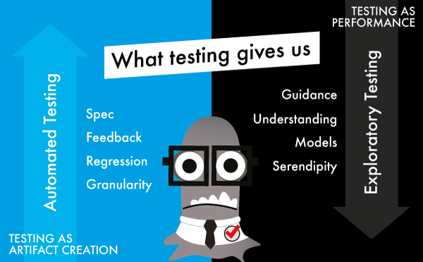
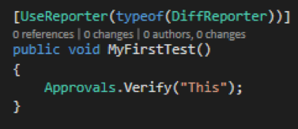
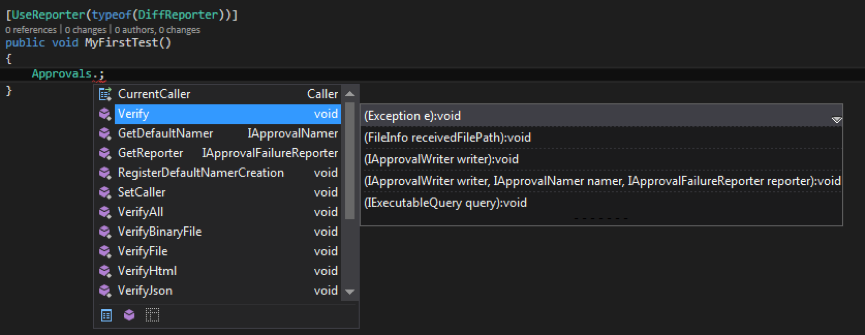
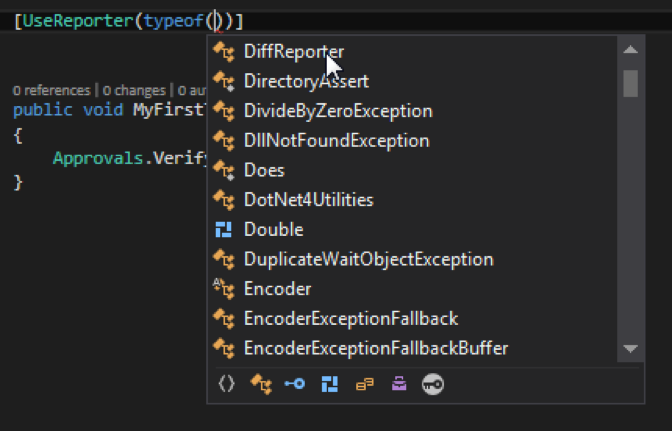

# Exploratory Testing an API

*This article was published in Ministry of Testing Testing Planet in 2016. Appropriate pieces of it will find their place as part of this book.*

As an exploratory tester I have honed my skills in testing products and applications through a graphical user interface. The product is my external imagination and I can almost hear it whispering to me: "Click here... You want to give me a different input... Have you checked out the log file I'm producing?"

Exploratory testing is a systematic approach to uncovering risks and learning while testing. The whispers I imagine are heuristics, based on years of experience and learning of how I could model the product in relevant ways to identify information relevant to stakeholders. While the product is my external imagination when I explore, I am my programmer's external imagination when they explore. They hear the same, unspoken whispers: "You'd want me to do this... I guess I should then." and they then become better testers.

I've only recently started applying this skillset on APIs - Application Programming Interfaces. An application programming interface is a set of routines, protocols, and tools for building software and applications. What triggered this focus of exploration effort was an idea to show at a conference how testing something with a code interface is still very similar to testing something with a GUI.  

With an API call, I can just fill in the blanks and figure out how the API sits in the bigger picture. There should be nothing that stops me from exploring through an API, but why haven't I done it before? And then as I started exploring an API with a testing mindset, I started seeing APIs everywhere, and finding more early opportunities to contribute.

## Why Is Exploratory Testing An API Relevant?

The way I look at the world of testing, I see two ways we look at good testing - testing as creating artifacts and testing as a performance. I learned this working side by side with Llewellyn Falco, a test-infected developer. Whenever he would explain the testing as he knew it, it was clear he was not speaking of testing as I knew it. We both talked about good testing, just very different ideas to it.

## Testing as Artifact Creation

People with automation first ideas to testing see testing as activity around creating artifacts. During the previous times before agile and extensive automation, the same testing was supposed to be covered by detailed test cases. I've lived with Agile ideals long enough to have moved to the idea that whatever is worth documenting in detail, it is probably worth documenting as test automation. This way of looking at testing tends to focus on what we know.

When we approach testing as artifact creation, our focus is primarily on solving the problem of creating right artifacts: what kinds of things would be useful automated? Where are the low-hanging fruit and what kind of automation would help us drive and support the development?

The test automation artifacts at best give us:

  * Spec - we know what we're building
  * Feedback - we know when it's built as we specified
  * Regression - we guard against things staying true over time
  * Granularity - we can pinpoint what went wrong when the tests fail.

## Testing As a Performance, (aka Exploratory Testing)

People with an exploratory testing background would be more inclined to see testing as a performance, like a show with improvisation, improving with practice and revealing new layers to how the performance goes. There's nothing that stops you from creating automation from that approach, but it starts with valuing different things. It starts with a focus on the things we don't know, and illusions we're holding true without empirical evidence.

In contrast to testing as artifact creation, exploratory testing gives us:

  * Guidance - not just yes/no, but a direction to better.
  * Understanding - being able to place the information into a bigger picture,
  * Models - ways to learn faster with supporting ideas or documents,
  * Serendipity - the lucky accidents that none thought of that emerge given enough time and variety to any application.

## What Does Testing Give Us?

We need both sides of the coin. Exploratory testing is a process of discovery, and it is entirely possible to discover information we did not have from extensive test automation using APIs as our external imagination.

There's inherently nothing in exploratory testing that requires we must have a user interface or have finalized features available. Still often I hear people expressing surprise at the idea that you can explore an API.

In addition, exploring an API is thought as something that is intended for programmers.  And an even more specific misconception is that exploratory testing could not use programming / automation as part of the exploration - that there would be something inherently manual required for exploration.

We must, as software testers, help team members understand that we can explore software in a variety of manual, automated and technical ways.

## An Example API with ApprovalTests

After a some time and research on considering a REST API or even some old Cobol APPC API or a framework/library programmers typically could use, I ended up with ApprovalTests. It is created by a developer friend with significant reliance on the greatness of his unit tests, and I welcomed the challenge to find problems through the means of exploratory testing.  

ApprovalTests is a library for deciding if your tests pass or not, with a mechanism of saving a result to a file and then comparing to the saved result. It also offers mechanisms of digging into the differences on failure. It has extensive unit tests, and a developer who likes to brag about how awesome his code is. The developer is a friend of mine and has a great approach to his open source project: he pairs with people who complain to fix things together.

ApprovalTests have a couple of main connecting points.

  * There are the **Approvals** that are specific to technology your testing. For example, my company used ExcelApprovals that packaged a solution to problem of having different yet same results with every run.

  * And then there are the **Reporters** that are a way of saying how you want to analyze your tests if they fail.

I personally know enough about programming to know to appreciate an IDE tool and the automatic word completion feature. The one in Visual Studio is called Intellisense. It's as if there is a GUI: I write a few letters, and the program already suggests me options. That's a  user interface I can explore, just as much as any other! The tools shows what the API includes.

Using the IDE word completion, I learn that Approvals has a lot of options in its API. Here is an example where to test specific technologies with Approvals, you would want to make different selections.  Documentation reveals that Approvals.Verify() would be a basic scenario.

I look at Reporters with the same idea of just opening up a menu, and find it hard to figure out what in the list are reporters.

I later learn that it's because of the word before, and that naming everything ReportWith would help make the reporters more discoverable.

I also learn that the names can improve to include better their intent, for example some are supposed to be silent - to run with continuous integration.

I go for online examples, and learn that they are images - not very user friendly. And I try to look for in-IDE documentation, and learn it's almost non-existent. I run existing unit tests to uncover they don't work at first run, but the developer fixes them quickly. And browsing through the public API with the tool, I note a typo that gets fixed right away.

The API has dependencies to other tools, specifically test runners (e.g. nUnit and MSTest) and I want my environment to enable exploring the similarities and differences with the two. Serendipitous order of installing the pieces reveals a bug in combination of using two runners in combination with a delivery channel (Nuget). Over the course of testing, I draw a map of the environment I'm working with, around ApprovalTests.  The map is a source of test ideas on the dependencies.

I don't only rely on the information available online, I actively ask for information. I ask the developer what Approvals and Reporters do, to get a long list of things that some do and some don't - this becomes a great source for more exploratory testing. Like a checklist of claims, and a great source for helping him tune up his user documentation.

Even a short exploration gave me ideas of what to dig in deeper, and issues to address for the developer. Some additional sessions with groups in conferences revealed more problems, and showed the power of exploratory testing on an extensively automation tested API.

## 13 Patterns To Help You Explore An API

It's OK if you are unfamiliar with the concepts above in the specific example, but I think the patterns below will help. They sum up my lessons learned on exploring an API myself, coming from a GUI-focused viewpoint.

### 1 - Focus: Working with limited understanding

As an exploratory tester, your goal could be to provide value with a limited amount of effort. As you are learning in layers, you need to choose the layers intelligently. There's no right or wrong answer on what to test first, but there are some usual candidates.

Some testers start looking at input fields. It's like "fill in the blank" or like testing Google search. What are the relevant things I could enter here?

How do I find the APIs to explore in the first place? Asking around, picking something people call an API or a library? Using tools like Fiddler that track particular technologies API calls from applications?

Others choose to start with documentation and collecting claims.

And others try to figure out a representative use case to get a basic feeling of what it would look like when this works.

Notes are useful here. Park some ideas that you could make use of later. Choose some to take action on. Continue to add more as you progress.

Regardless of what you do, you need to focus. Choose something. Learn. Choose something different. Learn more. Continue until you're satisfied with what you've tested or until you run out of time. The idea is that when time runs out, you've already done the best testing you could in that timeframe.

### 2 - Finding your building blocks

Tweak around a little, and you'll see it. There are calls and operations. There are inputs and outputs. There's requests and responses.  There are exceptions. There are dependencies. And all exist to serve a purpose.  Understand what your are the dials in the API that you can turn while testing.

You could play with the building blocks without understanding the purpose. You might discover the purpose through the building blocks. But the building blocks are your blanks to fill in: what you call, with what values, and what you expect to get back. Make a model of that.

You might call your inputs requests and your outputs responses. Find your vocabulary.

Also, look around for extending, could you be building something on top of these blocks?

### 3 - The environment it depends on

Your API probably does not exist alone. It depends on an environment. There's a specific syntax coming from the language in play. There's things it uses, and things that use it.

Understand what's in your scope ("your API") and what is outside it ("ecosystem in which your API provides value"). Draw a picture. Extend that picture as you're learning more.

### 4 - Specific user with a specific purpose

APIs have users. Often, the users are developers.  And developers are people with specific habits and expectations.

They expect things to be language-wise idiomatic, to follow the conventions they are used to living with. They expect particular styles of documentation. They expect discoverability.

Some of the best APIs are things where time to hello world (seeing it could work with some example) is short and do not include stepping out of your IDE.  

Talk to developers to learn some of their quirks. Listen to what they say about APIs they use and don't use. Listen to what they say about how they extend the APIs or work around their limitations.

In addition to intended use, there's also misuse.  What could go wrong if people misused your API? Also, pay attention to names. If your API has something called ReadStuff() and it ends up creating a lot of new data, that might be against what you expect. People use this. What could come in the way of that and what should come in the way of that?

### 5 - Usability of an API

There's great material out there on what makes a good API. It's really a usability discussion!  

When using the different commands/methods, what if they would be consistent in naming and in parameter ordering so that programmers using them would make fewer mistakes?

What if the method signatures didn't repeat many parameters of same type so programmers using them would get mixed up in the order?

What if using the API incorrectly would fail compile-time, not only run-time to give fast feedback?  

What if the methods would follow a conservative overloading strategy, an idea that two methods with same name would never have the same amount of arguments so that users can confuse the inputs? I had never heard of the concept before exploring an API, and run into the idea googling for ideas of what people say that make APIs more usable.

There's even a position in the world called Developer Experience (DX), applying the user experience (UX) concepts to the APIs developers use and focusing on things like Time to Hello world (see it run on your environment) and Time to Working Application (using it for something real). These ideas come naturally with an exploratory testing mindset.  

### 6 - Why would anyone use this?

APIs exist for a purpose. Even the free open-source APIs exist for a purpose. Many open source libraries hope to see more developers using them. Some may even be puzzled on why something this excellent isn't getting more traction. Sometimes with a lot of choice, you wonder why would you choose something that is difficult or does not serve your exact needs?

It's important that an exploratory tester asks, even faced with a programming interface the question of purpose:

  * Why does this exist?
  * Who finds this valuable and in what way?
  * What might come in between expected and received value?

### 7 - Think Lifecycle

You're probably testing a version you have just kindly received into your hands. There were probably versions before and there will be versions after. The only software that does not change is dead.  How does this make you think about testing?

  * How would change work on this API?
  * Is there a way for the user to recognize it's version?
  * How about removing functionality or replacing API calls, how long would you keep things marked deprecated in your interface?
  * And does that stop you from correcting even simple typos?

### 8 - Google for concepts

The world is full of sources. If you see a word you don't understand, Google is your friend. I ended up googling "Conservative Overloading Strategy" after I learned it's something you consider a feature of a good API.

Answers are usually only a few clicks away.

### 9 - Collaborate: Fact-track your understanding

You're not alone. Find someone to pair with. Find someone to ask questions from. Even if you start testing all on your own, you don't have to stay that way. Especially working on your own organizations APIs, try pairing with a programmer.

I often specifically recommend Strong-Style Pairing. If your paired partner has  better ideas on how to test, you take the keyboard. Then speak to get ideas from the others head through your hands into the computer.

It's not just hands-on testing you could collaborate on.  You could collaborate on coming up with things you should know to test about. Mindmap creation together is a wonderful way of building that information  to feed exploratory testing.

### 10 - Documentation matters a lot for APIs

For programmers to be able to use an API, they look at documentation with examples. If you're examples are in many languages and all over the place, you're not making it easier to find the basic stuff.

If there's no documentation, the usability and discoverability of your API should be good. Then again,  it could be that your users just have no options on what API to use for their purposes. That seems popular too.

### 11 - Explore to create documentation

Programmers might not find the documentation creation their strong point, and while exploring, you might become a subject matter expert in the use of the API you're testing.

Turn the things you've learned into things that make the product better.

  * Find the core of a new user's experience and describe that clearly
  * Add the deeper understanding of what (and why) the functionalities do into API documentation
  * Clean up and remove things from automatically created API documentation

### 12 - Some patterns become visible with repetition

I find myself doing almost or exactly same things many times before I understand what the API does for a specific type of case. Sometimes repetition helps me see subtle differences that should be tested for separately. Sometimes repetition helps me see how things are the same. I find that while exploring, I need to have patience to do things more than once, with my mind paying attention to all the subtle clues the API can give me. Learning is the key. When no longer learning, move on. But give yourself time, as repetition is necessary.

My two favorite quotes on this are:

  * It's not that I'm so smart, it's I just that I stay with the problems longer (Albert Einstein)
  * The more I practice, the luckier I get (Arnold Palmer)

I find a lot more insights digging in deeper than what is first visible. Manual repetition may be key for this insight, even on APIs.

### 13 - Disposable test automation

When you create these tests, they may end up being automated. Many times you have some level of automation to access your API. You have requests and responses, and you may have code around those. Some APIs you can't run without code. Your code might not include automatic results checking if you are just driving the API, not checking the results. But your code may also include theories about ideas that must hold true, like exploring if a rare error message over large data sample is really rare.

Most of all, with this automation you're creating, you need to critically ask yourself:

  * Could it be disposable, one time use?
  * The value of it is in the learning it provided now?
  * Are these tests that you want to see yourself maintaining?

Your set of automated tests will require maintenance. When tests fail, you will look into those.

Choose wisely. Choose when you learn what wise means.

## Summary
Exploring APIs gives you the power of early feedback and easy access to new skills closer to code. I suggest you give it a chance. Volunteer to work on something you wouldn't usually work on as a non-programmer. You'll be surprised to see how much of your knowledge is transferrable to "more technical" environment.
