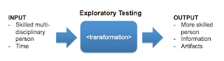

# Reporting and Notetaking

Exploratory Testing. The wonderful transformation machinery that takes in someone skilled and multidisciplinary and time, crunches whatever activities necessary and provides an output of someone more skilled, whatever documentation and numbers we need and information about testing.

What happens in the machinery can be building tools and scripts, it can be operating and observing the system under test but whatever it is, it is chosen under the principle of opportunity cost and focused on learning.

When the world of exploratory testing meets the world of test automation, we often frame same activities and outputs differently. When a test automation specialist discusses reporting, it seems they often talk about what an exploratory tester would describe as note taking.

Note taking is when we keep track of the steps we do and results we deliver and explain what we tested to other people who test. Reporting is when we summarize steps and results over a timeframe and interpret our notes to people who were not doing the testing.

Note taking produces:
   * freeform or structured text
   * screenshots and conceptual images
   * application logs
   * test automation that can be thrown away or kept for later

Reporting produces something that says what quality is, what coverage is, how long what we say now stays true, and what we recommend we would do about that.

Automation can take notes, count the passes and fails, summarize use of time. The application under test takes notes (we call  that logging) and it can be a central source of information on what happened.

When automation does reporting, that usually summarizes numbers. I find our managers care very little for these numbers. Instead, the reporting they seek is releases and their contents.

When automation does log of test case execution, we can call that a report. But it is a report in scope very different than what I mean by a report from exploratory testing - including automation.
