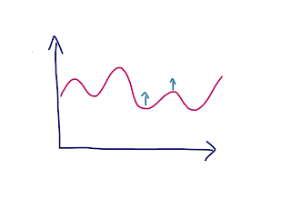
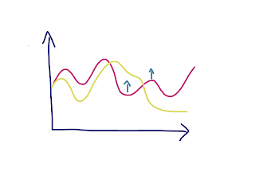
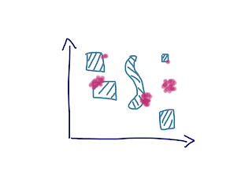

# Learning about Learning

As an exploratory tester, I've come to appreciate that a core of my skills is that I have been learning about learning, and having practiced mostly learning about products, technology, organizations, businesses and people for a quarter of a decade, I have somewhat of a hang of it.

Having a hang of it shows particularly when I change organizations, like I did 2 months ago. Even if I say so myself, I've taken in the new organization at a good pace and have been contributing since beginning, but to my expected level of exceeding expectations starting from the second month.

Even though I still consider testing (and software productivity) more professional core, I find that the stuff I am learning about learning applies just as much to other roles. Today I took a moment to deliver a 30-minute broadcast inside my organization, talking just about learning. Since most of you could not join an internal session, I decided on a blog.

## Foundation, the Math

Imagine you were awesome. Your results are great. You know how to get the job done. Every day when you come to work, you deliver steadily. Sounds great?

Many of us are awesome and deliver steadily. We are as productive today as we are in a year. Solid delivery.

But learning changes the game.

Imagine you and your colleague are equally awesome. You both deliver steadily today. But your colleague, unlike you, takes time away from every single working day to improve their results. They find a way to become 1% better every week, shaving off 4 minutes of time from completing something of significance. In a year, you're still awesome like you were before. But your colleague is 1.7 times their past self due to learning.

1% a week may sound a lot, or a little, but the learning accumulates. If we learned in ways that transform out results 1% each day, a year gives us 37.8 times our past selves.

This sums our working days into two activities: We are either learning or contributing. Both are valuable. We could use most of our office hours to achieve that 1% improvement every day to match our past selves in a year. The investment to learning is worthwhile.

## From Learning Alone to Learning Together

Now that we've established the idea that learning is worthwhile investment, we can discuss our options for using that investment. Learning does not happen only while we take special learning time to show up on a course, but most of it is on the job. Volunteering to do that cloud configuration you've never done before - now you have. Volunteering to take a first effort at the UX design even though you're not a UX designer - now that you are in control of the tasks and your learning, those with more experience can help you learn. Learning is a deliberate action.

The usual way we work is solo. We bring our best and worst into the outcome we're producing, and a traditional way of approaching this is that others will join after you in giving you feedback of things you may have missed.

Every comment to a pull request helps you address something you missed now, and learn for later cycles. Every bug someone reports after you both internally and externally, does the same. Every time a new requirement emerges because the application serves as someone else's external imagination, you learn about how you could see things coming and are able to make informed rather than accidental choices.

With the traditional solo - handoff style, every one of us needs to learn just enough about the work to be able to contribute our bit. If we don't know much about the work, that limits our contribution to what we know of.

Imagine you were rather learning through pairing. Building the understanding of the task together. Not filtering the feedback based on what makes sense to ask of you as you already implemented it in one way. Instead of getting the best out of you into the work you're doing, you get the best out of both of you.

Ensemble programming is bringing a pair to more people, a whole team and seeing the curve positively flatten as everyone is learning and contributing, provided we first learn how to listen and to work well together.

## From individuals to seeing the system

Learning on its own is a little abstract. What is it that we are learning about?

What I talked about today, is that we're learning everything we can to optimize the meaningful outcomes from software development. It might be learning a keyboard shortcut to save time in completing an action (microlearning). It might be learning to innovate how collaboration works in our organization. And to frame that in software development, understanding it as a process there smart people transform ideas into code without being alone with all this responsibility helps frame it.

Nothing changes for the users unless we change the code.

If we know the right idea to change the code without people other than developers making the change, we could do just that. But we understand that fine-tuning ideas is where the rest of the organization comes to play, and that software does not exist in a vacuum without the services around it.

Some of those percents of betterment come from stopping at looking at ourselves and starting to look at the system of people that co-creates the value.

## Learning Never Stops

The final piece I discussed today was about the idea of a Senior vs. Junior. It's not that the first knows more than the latter in some basic absolute scale. Knowing something is multidimensional, and even those of us who are seniors don't know everything. Partially this comes from the fact that there is already too much to know for a person, but also from the fact that more to know emerges every day.

Just like a senior takes on work they need to figure out doing it, so does the junior. The complexity of the tasks expected to be figured out is very different, but one of the powers of great seniors is that we can accelerate the learning of the juniors. We don't have to put them through our struggles, they can find a new innovative struggle even when the latest of how we enable them is in place.

Even if a senior knows more things, there are still things they can learn from the junior if they listen and pay attention.  

## Ideas to take this further

As part of my in-company broadcast series on things I want to talk on allowing people to join me and have a conversation, today's conversation part was particularly successful. My theme today was ROI (Return on Investment) of Learning, and three themes stood out from the comments:

   * Unlearning to make space for new learning - can take double the effort and requires listening to new people giving hints on things you may need to act on
   * New to industry or new to an organization - no need of deliberately looking for things to learn, the work already stretches you.
   * Microlearning - more examples of the little stretches, more stories of things we didn't know but learned would help us a long way.
