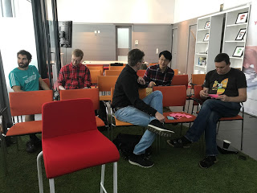

# How would you test a textfield?

I've been doing tester interviews recently. I don't feel fully in control there as there's an established way of asking things that is more chatty than actionable, and my bias for action is increasing. I'm not worried that we hired the wrong people, quite the opposite. But I am worried we did not hire all the right people, and some people would shine better given a chance of doing instead of talking.

One of the questions we've been using where it is easy to make step from theory to practice is **How would you test a text field?** I asked it in all, around a whiteboard when not on my private computer with all sorts of practice exercises. And I realized that the exercise tells a lot more when done on a practice exercise.

In the basic format, the question talks of how people think of testing and how they generate ideas. The basic format as I'm categorizing things here is heavily based on years of thinking and observation by two of my amazing colleagues at F-Secure Tuula Posti and Petri Kuikka, and originally inspired by discussions on some of the online forums some decades ago.

## Shallow examples without labels - wannabe testers

There's a group of people who want to become testers but yet have little idea of what they're into, and they usually tend to go for shallow examples without labels.

They would typically give a few examples of values, without any explanation of why that value is of relevance in their mind: mentioning things like text, numbers and special characters. They would often try showing their knowledge by saying that individual text fields should be tested in unit testing, and suggest easy automation without explaining anything else on how that automation could be done. They might go talking about hardware requirements, just to show they are aware of environment but go too far in their idea of what is connected. They might jump into talking about writing all this into test cases so that they can plan and execute separately, and generate metrics on how many things they tried. They might suggest this is a really big task and suggest to set up a project with several people around it. And they would have a strong predefined idea of their own of what the text field looks like on screen, like just showing text.

## Seeing the world around a text box - functional testers

This group of people have been testers and caught up some of the ideas and lingo, but also often over reliance on one way of doing things. They usually see there's more than entering text to a text box that could go wrong (pressing the button, trying enter to send the text) and talk of user interface more than just the examples. They can quickly list categories of examples, but also stop that list quit quickly as if it was irrelevant question. They may mention a more varied set of ideas, and list alphabetic, numeric, special characters, double-byte characters, filling up the field with long text, making the field empty, copy-pasting to the field, trying to figure out the length of the field, erasing, fitting text into the visible box vs. scrolling, and suggest code snippets of HTML or SQL, the go to answer for security. They've learned there's many things you can input, and not just basic input into the field, but it also has dimensions.

This group of people often wants to show the depth of their existing experience by moving the question away from what it is (the text field) to processes and emphasize experiences around how relevant it is to report to developers through bug reports, how they may not fix things correctly and how a lot of time goes into retesting and regression testing.

## Tricks in the bag come with labels - more experienced functional testers

This group of testers have been looking around enough to realize that there are labels for all of the examples others just list. They start talking of equivalence partitioning and boundary values, testing positive and negative scenarios and can list a lot of different values and even say why they consider they're different. When the list starts growing, they start pointing out that priority matters and not everything can be tested, and may even approach the idea of asking why would anyone care of this text field, where is it? But the question isn't the first  thing, the mechanic of possible values is.  They prioritization focus takes them to address use of time into testing it, and they question if it is valuable enough to be tested more. Their approach is more diversified and they often are aware that some of this stuff could be tested on unit level and others require it integrated. They may even ask if seeing the code is available. And when they want to enter HTML and SQL, they frame those not just as inputs but as ideas around security testing. The answer can end up long, and show off quite much of knowledge. And they often mention they would talk to people to get more, and that different stakeholders may have different ideas.

## Question askers - experienced and brave

There's a group who seems to know more even though they show less. This group realizes that testing is a lot about asking questions, and mechanistic approach of listing values is not going to be what it takes to succeed. They answer back with questions, and want to understand typically the user domain but at best also the technical solution. They question everything, starting with their understanding of the problem at hand. What are they assuming, and can that be assumed? When not given a context of where the text field is, they may show a few clearly different ones to be able to highlight their choices. Or if the information isn't given, they try to figure out ways of getting to that information.

The small group I had together started just with brainstorming the answer. But this level wasn't where we left off.

After the listing of ideas (and assumptions, there was a lot of that), I opened a web page on my computer with a text field and an ok button and had the group mob to explore, asking them to apply their ideas on this. Many of the things they mentioned in the listing exercise just before immediately got dropped - the piece of software and possibility to use it took people with it.

## The three exercises

The first exercise was a trick exercise. I had just had them spend 10 minutes thinking how they would test, and mostly they had not thought about the actual functionality associated with the text field. Facing one, they started entering values and looking at output. Over time, they came up with theories but did not follow up testing those and got quite confused. The application's text field had no functionality, only the button had. After a while, they realized to go into dev tools and the code. And were still confused with what the application did. And with a few rounds of three minutes each on the keyboard, I had us move on to the next example.

The second exercise was text box in the context of a fairly simple editor application, but one where focusing on the text box alone without the functions immediately connected to the text box (unit test perspective) would miss a lot of information. The group was strong on ideas, but weaker on execution. When giving a value, what a tester has to do is to stop (very shortly) and look at what they learned. The learning wasn't articulated. They missed things that went wrong. Things where to me, an experienced exploratory tester, the application is almost shouting to tell how it is broken. But they also found things I did not remember, like the fact that copy pasting did not work. With hints and guidance through questions, I got them to realize where the text box was connected (software tends to save stuff somewhere) and eventually we were able to understand what we could do with the application and what with the file it connects to. We generated ideas around automation, not through the GUI but the file and discussed what kind of things that would enable us to test.  When asked to draw a conceptual picture of relevant pieces, they did good. There was more connections to be found, but that takes either a lot of practice on exploring or more time to learning layers.

Again with the second exercise, I was left puzzled on what I observed. They had a lot of ideas as a group on what to try, but less of discipline in trying that out of following what they had tried. While they could talk of equivalence partitioning or boundaries, their actual approaches on thinking what values are equivalent and learning more as they used the application left something to hope for. The sources of actual data were interesting to see, "I want a long text" ended up as something they could measure but unawareness immediately of an online tool that would help with that. They knew some existed but did not go to get those. It could have been a priority call, but they also did not talk about doing a priority call. When the application revealed new functionality, I was making a mental note of new features of the text box I should test. And when that functionality (ellipsis shortening) changed into another (scroll bars), I had a bug in mind. Either they paid no attention, or I pointed that out too soon. Observation and reflection of the results was not as strong as idea generation.

The third exercise was a text field in a learning API, and watching that testing unfold was one of the most interesting ones. One in the group quickly created categories of three outputs that could be investigated separately. This one was on my list because the works right / wrong is multifaceted, and in the perspective of where the functionality would be used and how reliable it would need to be. Interestingly in the short timeframe we stick with data we could easily generate, and this third one gave me a lot to think about as I made later one of my teams's developers test it, getting them even stronger into testing an output at a time, and insisting on never testing an algorithm without knowing what it includes. I regularly test their algorithms of assessing if the algorithm was good enough for the purpose of use, and found that the discussion was around "you shouldn't do that, that is not what testers are for".

The session gave me a lot of food for thought. Enough so that I will turn this into a shorter session teaching some of the techniques of how to actually be valuable. And since my conference tracks planned are already full, I might just take an extra room for myself to try this out as the fourth track.
