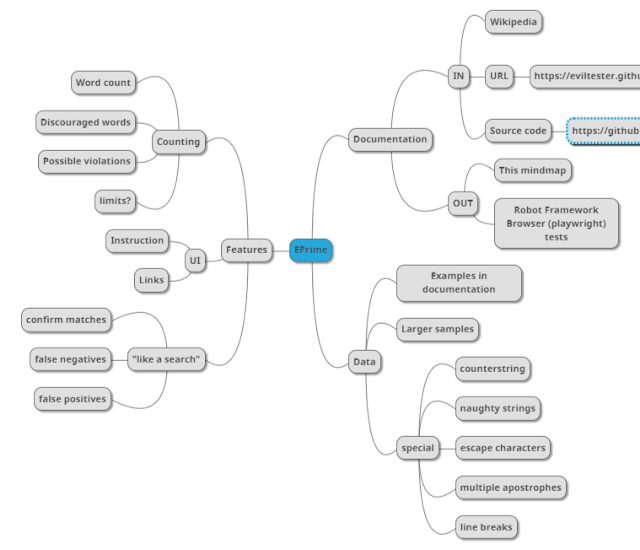

## Exploring a WebUI with Automation

Open space conferences like Socrates UK Digital Summer provide a great platform for making a little progress on finding ways to teach about exploratory testing in writing. For purposes of writing, I run an ensemble testing session to compare notes of what I did in prep alone vs. where the group ends up. Putting the two together could provide useful lessons for those who did not get to join.

For these sessions, I picked up a new test target. Eviltester posted some of his testing apps and games a while back, and EPrimer ended up as my choice as it promised
  * Not heavy on bugs - could actually focus on testing instead of bug reporting
  * Completely unknown domain: proper English language writing style "eprime" I had never heard of.
  * WebUI with beautiful IDs

At this point, I encourage you to follow [the link](https://eviltester.github.io/TestingApp/apps/eprimer/eprimer.html) to the app and stop reading what I say before you tried it out yourself. If you did not follow my encouragement, I suggest that after reading this, pick up another of the eviltester test targets and apply what you learned here.

> Session Charter:  Explore EPrimer focusing on two kinds of documentation as output: test automation you can run (using e.g Robot Framework) and a mindmap. Time: 1 hour plus learning time for test automation tool if you have no experience and no expert available answering your questions in the moment.

## Two sessions, two results

As expected, the two session provided very different results that complement one another.

Session one produced ~30 tests one can run again, spread over 7 test suites, each named on the type of collection of data it was testing and a mindmap on realization that all tests were on single function while there were multiple but covered the domain description as specification well, identifying multiple problems against specification.

Session two produced 5 tests one can run again, all in 1 test suite where a bit of commenting out is necessary to get the tests to run later. The coverage of functions was significantly better and the session identified 2 bugs. No mindmap was created and better function coverage came from choosing to understand everything a little and not diving systematically into specification. Single created test covered more ground.

## Breakdown of activities

Whenever we are doing exploratory testing, we get to make choices of where we use our limited time based on the best information available at the time of testing. We are expected to intertwine various activities, and when learning, it may be easier to learn one activity at a time before intertwining them.

If you think back to learning to drive (while stick gear was a thing), you probably have ended up in an intersection, about to move forward and your car shutting down as intertwining your actions with the gear and pedals were not quite as they should. You slowed down, made space for each activity and got the car moving again. Exploratory testing is like that, you control the pace and those who have practiced long will be intertwining activities in a way that appears magical.

For this testing target, we had multiple activities we needed to intertwine (learn / design / execute):
   * Quickly acquiring domain knowledge: no one knew what eprime is, and we had our choice of reading about it.
   * Acquiring functional knowledge: using the application and figuring out what it does.
   * Creating simple scripts with multiple inputs and outputs: using same test as template for data-driven helps repeat similar cases in groups.
   * Identifying css selectors: if you wanted test automation scripts, you needed to figure out what to click and verify and how to refer to those from the scripts.
   * Controlling scope of tests: see it yourself, see it blink with automation, repeat all, repeat only the latest.
   * Creating an invisible or visible model: Seeing SFDPOT (Structure, Function, Data, Platform, Operations, Time) to understand coverage in selected or multiple dimensions
   * Cleaning up test automation: Improving naming and structuring to make more sense than what was created in the moment.
   * Using the application: Making space for chances to see problems beyond the immediate test
   * Identifying problems: Recognizing problems with the application.
   * Documenting problems: Writing down problems in either test automation or otherwise.
   * Working to systematic coverage: Pick a dimension, and systematically cover it learning more on it.
   * Reading the code: We had the code and we could read it. That could add to our understanding.

Taking another two hours on top of the two hours on cleaning up the results. I summarized final results like this:

> After 2 hours of #ExploratoryTesting documented with automation, it took another 2 hours to clean it up. 52 tests total, 38 passed, 14 failed. Quite many bugs as per specification. Time on app has been maybe 30 minutes of this 4 hours.

The app isn't completely tested, as the exercise setting biased us towards documentation.

## Examples of activities

*Quickly acquiring domain knowledge*. Reading the specification of eprime. Focusing on examples of eprime. Refreshing knowledge of English grammar around the verb "to be" e.g. 5 basic forms of verbs and 6 different types of verbs, or 6 categories of verbs - all things I googled for as I am writing this. While the specification tells what knowledge was probably used to create the application, there is domain knowledge beyond what people choose to write down in specification.

*Acquiring functional knowledge*. Using the application. Asking questions about what is visible, particularly the concepts that are no obvious: 'What is Possible Violations?".  Seeking data demonstrating it could work. Seeking large data to demonstrate functions through serendipity.

*Creating simple scripts with multiple inputs and outputs*. Writing test automation that allows for giving multiple input and output values as parameters. Getting into the tool and into using the tool.

*Identifying css selectors*. Getting to various values with code, understanding what is there in different functions to click and check. Feeling joy systematic ID use making the work easier.  Recognizing conflicts in UI language and selector language.

*Controlling scope of tests*. Moving tests to separate files. Commenting out tests that already work. Running tests one by one.

*Creating an invisible or visible model*. Ensuring we see all things work once before we dig deeper in any individually. Creating a map of learning in the last minutes of the session. Writing down notes of what we are seeing as either test automation or other types of documents.

*Cleaning up test automation*. Rename everything named foo at time when we knew the least. Comment out things to focus on the next thing getting done efficiently. Using domain concepts as names of collections.

*Using the application*. Spending time using the application to allow for serendipity. Observing look and feel. Observing selected terminology.

*Identifying problems*. Seeing things that don't work. Like visual of it that is very bare-bones. Or line breaks turning valid positives into false negatives.

*Documenting problems*. Writing these down in test automation. Figuring out it we want to leave it passing (documenting production behavior) or failing (documenting bugs). Remembering issues to mention. Writing them down as notes. Writing a proper bug report.

*Working to systematic coverage*. Stopping to compare models to how well those are covered. Creating a visual model. Covering everything in the specification. Covering all visible functionality.

*Reading the code*. Closing the window that has the code as it gets in the way of moving between windows. Reading the code to see how concepts were implemented.  

## Some Reflections

Every time I teach exploratory testing, I feel I should find ways of teaching each activity separately. There is a lot going on at the same time, and part of its effectiveness is exactly that.

In the group, someone suggested we could split the activity so that we first only document as test automation, not caring about any of the information other than what is true right now in the application. Then we could later review it against specifications and domain knowledge. That could work. It would definitely work as one of the many mixes when exploring - change is the only constant. This split is what approval testing is founded on, yet I find that I see different things when I use the application and create documentation intertwined, than receiving documentation that I could review. One night in between the actions is enough for me to turn into a different person.

## The Final Deliverables

In the last minutes of one of the sessions, I cooked up a mindmap of what was in my head on the application. I had only covered a small portion, focusing on counting Discouraged words.

The robot tests from the two sessions combined with cleanup are available on [github.](https://github.com/maaretp/exploring-robot-framework/tree/master/eprime)
