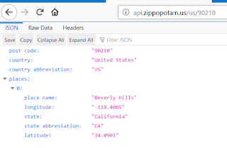
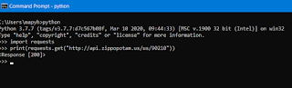

#Python Primer for Exploring an API

With first of our release, I taught the most straightforward way I could to test an API for my summer trainee. I gave them a URL (explaining what a URL is), showed different part of it indicated where you connected and what you were asking for and ended up leaving office for four hours letting them test for the latest changes just as other people in the team wanted to get out of office for their summer vacation. They did great with just that in my absence, even if they felt the responsibility of releasing was weighing on them.

No tools. No postman. Just a browser and an address. Kind of like this: http://api.zippopotam.us/us/90210



The API we were testing returned a lot more values. We were testing 20000 items as the built-in limit for that particular release, and it was clear that the approach to determine correctness was sampling.

Two weeks later, today we returned to that API, with the idea that it was time to do something more than just looking at results in the browser.

## Python, in the interpreter

We started off by opening a command line, and starting python.



As we were typing in `import requests`, I explained that we're taking a library into use. Similarly I explained `print(requests.get("http://api.zippopotam.us/us/90201"))`, forgetting the closing parenthesis at first and adding it on a line after.

With the 200 response, I explained the idea of this code meaning it was ok, but we'd need more to see the message we had earlier seen in a browser, and that while we could also use this for testing, we'd rather move to writing our code to a file in an IDE.

## Python like a script, in Pycharm

As we opened Pycharm and created a .py file to write things in, the very first lines were exactly the same ones we had been running from command line. We created two files. First `requirements.txt` in which we only wrote `requests` and second file ended up with name `experiments.py`. As the two lines were in, Pycharm suggested installing what requirements.txt defined and we ensured it was still running just the same. At first we found the Run menu in IDE, later the little green play buttons started to seem more appealing as well as the keyboard shortcut for doing this one often.

We replaced the print with a variable that could keep our response to explore it further
`response = requests.get("http://api.zippopotam.us/us/90210")`
typing in `response.` and ctrl+space, we could see options of what to do with it and settled with
`print(response.text)`
At this point, we could see the same text we had seen before in browser, visually verify it just as much as with the browser and were ready to move on.

Next we started working on the different pieces of the URL, as we wanted to test same things in different environments, and our API had a few more options than this one I use for educational purposes here.

We pulled out the address into a variable, and the rest of it into another, and concatenated them together. for the call.

`import requests
address = "http://api.zippopotam.us/"
rest_of_it ="us/90210"
whole_thing = address + rest_of_it
response = requests.get(whole_thing)
print(response.text)`

The API we were playing with had a lot more pieces. With environments, names, id's, dates, limits and their suffixes in the call we had a few more moving parts to pull out with the very same pattern.

As we were now able to run this for one set of values, our next step was to see it run for another set of values. On our API, we're working on a data-specific bug that ends up giving us a different status code of 500, we wanted to move for the idea of seeing that here.

Making the status code visible with

`print(response.status_code)`

we started our work to have calls of the whole_thing where it wasn't what we started with but had multiple options.

`#rest_of_it ="us/90210"
rest_of_it = "fi/00780"`

Every option we would try got documented, but the state of changing one into a comment and another into the one we would was not what we'd settle for.

We wanted two things:
   * a method that would take in the parts and form the whole_thing for us
   * a way of saving the results of calls

We started with keeping a part of the results introducing pytest writing that into requirements.txt as second line.

`requests
pytest`

Again we clicked an ok adding what our environment was missing as Pycharm pinged us on that, and saved the response code codifying it into an assert. We remembered to try other values to see it fail to trust it in the first place.

`assert response.status_code == 200`

Us still wanting the two things above, I interrupted our script creation to move us a step in a different direction.

## Python like a Class and Methods, in Pycharm

We googled for "pytest class example" under my instructions, and after not liking the first glance of the first hits, we ended up on a page: https://code-maven.com/slides/python-programming/pytest-class

We copied the example as `experiments_too.py` file contents on our IDE.

We hit a mutual momentary hiccup, to figure out three things:
   * We needed to set pytest as our default test runner from File | Settings | Tools | Python integrated tools | Default test runner.
   * The file must have Test in name for it to be recognized as tests
   * We could run a single test from the green play button next to it

The original example to illustrate setup and teardown had a little bit too much noise, so we cleaned that up before starting to move our script in to the structure.
```
class TestClass():

     def setup_class(self):
        pass

    def teardown_class(self):
        pass

    def setup_method(self):
        pass

    def teardown_method(self):
        pass

    def test_one(self):
       assert True
```

We moved everything from the script we had created inside `test_one()`
```
def test_one(self):
    import requests
    address = "http://api.zippopotam.us/"
    # rest_of_it ="us/90210"
    rest_of_it = "fi/00780"
    whole_thing = address + rest_of_it
    response = requests.get(whole_thing)
    print(response.text)
    assert response.status_code == 200
```
And we moved the import from inside the test to beginning of the file to have it available for what we expected to be multiple tests. With every step, we run the tests to see they were still passing.

Next, I asked the trainee to add a line right after `def test_one(self)` that would be like we imagined what we'd like to call to get our full address. We ended up with

`define_address("foo", "bar")`

representing us giving two pieces of text that would end up forming the changing parts of the address.

A little red bulb emerged on the IDE next to our unimplemented method (interjecting TDD here!) and we selected Define function from the little menu of options on the light bulb. IDE created us a method frame.
```
def define_address(param, param1):
    pass
```

We had already been through the idea of Refactor | Rename coming up with even worse names and following the "let's rename every time we know a name that is better than what we have now" principle. I wouldn't allow just typing in a new name, but always go through Refactor to teach the discipline that would be benefiting from the tooling. Similarly, I would advice against typing whole words but allowing IDE to complete what it can.

We moved the piece of concatenating two parts together into the method (ours had a little more parts than the example).
```
def define_address(part1, part2):
    whole_thing = part1 + part2
    return whole_thing`
```

and were left with a test case where we had to call the method with relevant parts of the address
```
def test_one(self):
    # rest_of_it ="us/90210"
    response = requests.get(define_address("http://api.zippopotam.us/", "fi/00780"))
    print(response.text)
    assert response.status_code == 200
```
The second test we'd want as comment in the first became obvious, and we created a second test.
```
def test_two(self):
    response = requests.get(define_address("http://api.zippopotam.us/", "us/90210"))
    assert response.status_code == 200
```

### Verifying that response.text

Now that we had established the idea of test cases in a test class and structure of a class over writing just a script with a hint of TDD, we moved our attention to saving results of the calls we were making. Seeing "200 success" isn't quite what we'd look for.

In the final step of the day, we introduced `approvaltests` into `requirements.txt` file.

```
approvaltests
pytest-approvaltests
```

We edited two line of our file, adding

`from approvaltests.approvals import verify`

and changing print to verify
`verify(response.text)`

We run the tests from terminal once to see them fail (as we saw them be ignored without this step on the usual run)

```
pytest --approvaltests-use-reporter='PythonNative' TestClass.py`
```

We saw a file `TestClass.test_one.received.txt` emerge in our files, and after visually verifying it captured what we had seen printed before, we renamed the file as `TestClass.test_one.approved.txt`. We run the tests again from the IDE to now see them pass, edited the approved-file to see it fail and corrected it back to verifying our results match.

As finalization of the day, we added verification on our second test, again visually verifying and keeping the approved file around.

```
def test_one(self):
    response = requests.get(define_address("http://api.zippopotam.us/", "fi/00780"))
    verify(response.text)
    assert response.status_code == 200`
```

And finally, we defined `approvaltests_config.json` file to include information where the files approvaltests create should go
`
{
  "subdirectory": "approved_files"
}
```

These steps give us what we could do in a browser, and allow us to explore. They also help us save results for future with minimal effort, and introduce a baseline from which we can reuse things we've created.
